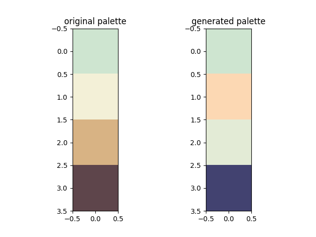

# Pastel Colours project
## Investigating the generation of pastel colour palettes based on data
This project is inspired by http://colormind.io/, which trained a GAN (Generative Adversarial Network) to generate 
colour palettes. 
I initially began this project because I believed there was some room for improvement in the methodology colormind 
describes, particularly regarding colour representations. I then extended the project further to focus on generating 
pastel colour palettes, because I am a massive sucker for pastel colours. This involved overcoming some interesting 
challenges, due to the relative low number of pastel colour palettes available as data.

## Contents
*   Colormind Methodology
*   Data
*   GAN Solution
*   Colour Analysis
*   Gaussian State Machine Solution

## Colormind Methodology

## Data

## GAN Solution

## Colour Analysis

## Gaussian State Machine Solution
