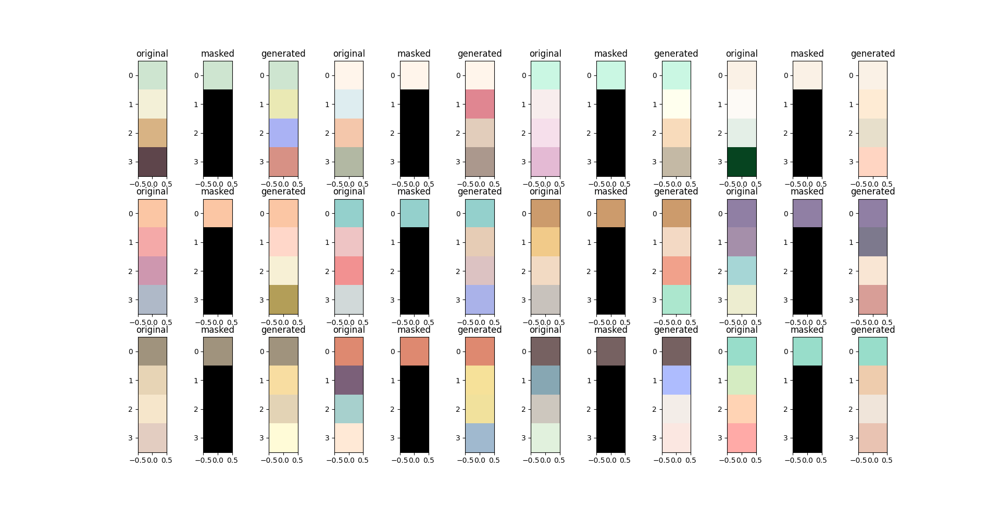
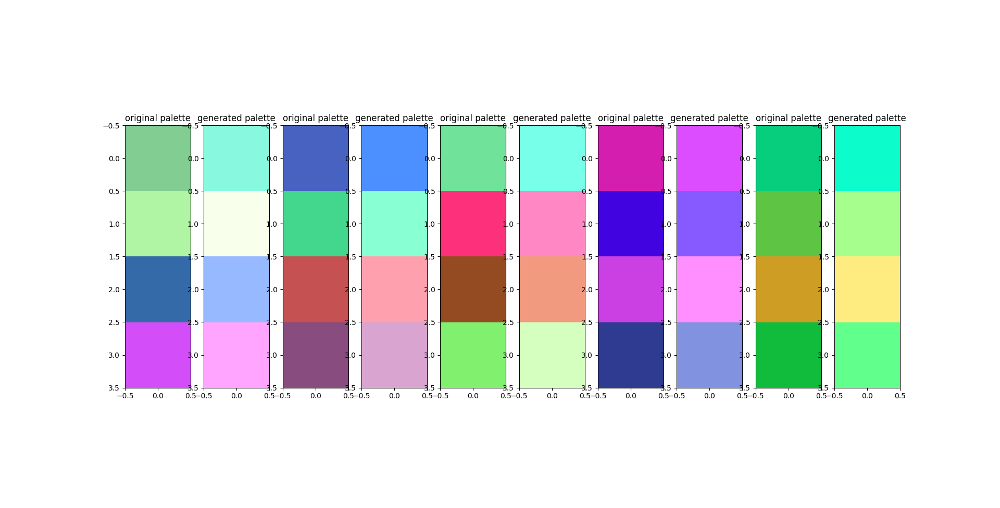
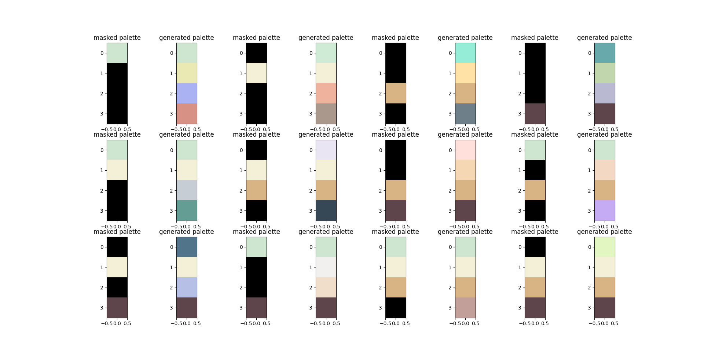

# Pastel Colours project
## Investigating the generation of pastel colour palettes based on data
This project is inspired by http://colormind.io/, which trained a GAN (Generative Adversarial Network) to generate 
colour palettes. 
I initially began this project because I believed there was some room for improvement in the methodology colormind 
describes, particularly regarding colour representations. I then extended the project further to focus on generating 
pastel colour palettes, because I am a massive sucker for pastel colours. This involved overcoming some interesting 
challenges, due to the relative low number of pastel colour palettes available as data.

## Contents
*   Running Demo
*   Development
    *   Colormind Methodology
    *   Data
    *   GAN Solution
    *   Colour Analysis
    *   Gaussian State Machine Solution

## Running Demo
**train_gaussian_state_model.py** currently loads the model and data and displays some results. The model can either 
train from scratch or load a previously trained model given a path. Currently this must be done by setting the 
appropriate variables at the top of the file. By default, the constant **LOAD_MODEL=False** ensures a new model is 
trained and saved everytime the file is run.

There are several different functions which display different results.  
**display_generations(source_palette)** takes a single source palette and applies 12 different masks to it, generating 
a new palette from the masked source for each mask. All generated palettes are displayed. alognside the original 
and mask, in a grid in a single figure.  
**display_samples()** takes the first 12 palettes in the dataset, masks all but the first (primary) colour, 
and generates a new palette from that. All 12 generations are displayed alongside the original palette in a figure. 
**display_sample()** takes a single palette, masks all but the first (primary) colour, generates a new palette based 
on that primary colour, and displays all three palettes.  
Setting **SAVE_RESULTS** to True will save these figures.

## Development

### Colormind Methodology
Colormind trains a GAN to generate new colour schemes based on a dataset of colour schemes, apparently available via 
adobe. Interestingly, the site's method description seems to suggest that the GAN was trained on *images* of colour 
schemes - that is NxM image arrays where each colour would be represented by a NxN block of pixels with identical RGB 
values. This seems unecessarily wasteful, since with this setup a large proportion of the neural network's capacity 
will always be wasted on learning that all pixels in each colour block have the same value.  
In other words a large number of parameters in the network will always be spent on learning a pattern we already know, 
and as a general rule the more parameters a neural network has the more susceptible it becomes to overfitting. Thus 
by encoding the knowledge we already have - that all the pixels in each colour block will have the same value - into 
the data representation, we can dramatically reduce the number of parameters in the network without eliminating any 
of the patterns we are actually interested in from the dataset. This should help combat overfitting and, if nothing 
else, at least make the network dramatically more efficient for free.  
So in this project I represented each colour palette as a single vector of shape 1xP, where P = 3K and K is the number 
of colours in the palette. That is, each colour is represented by a single RGB vector, and all RGB vectors of the 
palette are then concatenated into a single vector.

### Data
I scraped my own colour palette data from https://colorhunt.co/. This page presents 4-colour palettes, unlike the 
5 colours used by colormind. As I was interested in pastel colour palettes specifically, I then filtered the palettes 
by the "pastel" tag. This gave me 191 colour palettes; with 4 RGB vectors per palette, this gave me a dataset of 191 
size-12 vectors. As each vector in the dataset has a size that is about 6% of the total number of samples, it is clear 
that the number of samples relative to the size of the datapoints is fairly small, and overfitting was certainly going 
to be a challenge when training the networks.  

### GAN Solution
At first a GAN solution was attempted. The details of what I worked through are described in **devlog/devlog.md**, but 
long story short, after extensive hyperparameter tuning this is the solution I arrived at:

Essentially, given an input of randomly generated colours, the network softens them to generate pastel shades. 
However, it does not really seem pay attention to the overall colour scheme; basic colour theory tells us that the hue 
of colours should have some dependency on each other in a colour scheme in other words: some colours go together 
better than others). The trained network seems to have failed to capture such holistic properties, and without more 
samples it might be difficult to train the network to recognise this property without overfitting.    

### Colour Analysis
Since I know there should be some conditional dependency between the different colours of the palette, I looked at the 
colour distributions manually. First of all, the dataset was converted from RGB into HSV space. While RGB is a 
convenient physics-based representation of colour, it's less useful when it comes to understanding human perception of 
colour, which is the focus of this project. For this HSV (Hue, Saturation, Value) is better suited. Pastel colours are 
also far more clearly defined in HSV space than RGB space: in HSV space, a pastel colour is any colour with low 
saturation and high value (with any arbitrary hue), whereas in RGB space pastel values are defined by a more complex 
interplay between the R, G, and B values. Plotting the HSV coordinates of the colours for each colour position in the 
palettes (i.e. the primary colours, the secondary colours, etc.) reveals the following:  
*   Colours tend to be organised into 3 general groups along the hue axis. That is, colours are more likely to be reds 
    or green-blues than yellows or purples.
*   While primary and secondary colours tend to be clearly pastel colours (all with low saturation and high values), 
    the tertiary and quaternary colours aren't always strictly speaking pastels - they also contain many colours with 
    high saturation and/or low value (i.e. strong or dark colours). In the context of pastel colour palettes, these 
    would likely work as highlights/lowlights to contrast against the overall pastel colour scheme.  

### Gaussian State Machine Solution
Based on these observations, a new generation mechanism was designed:  
*   Each colour was modelled with an independent Gaussian Mixture Model with 3 components (based on the observation 
    that each colour seemed to cluster into 3 general groups along the hue axis).
*   The interdependencies between each of the colours were then approximated. i.e. given an observed HSV value for a 
    particular colour, we can use that colour's GMM to estimate the posterior - the probability of each Gaussian 
    component given the observed datapoint. We then use this posterior of the observed value to estimate the posteriors 
    of the unobserved GMMs; i.e. given the observed posteriors, what is the most probable posterior distribution of 
    each of the unobserved colours, given the data? This is modeled by a simple linear transformation from each 
    observed posterior to each unobserved posterior, and the weights of this linear transformation are trained via 
    gradient descent. Once all the posteriors are estimated, each colour can be sampled from its respective GMM using
    its estimated posterior to weigh the sampling probability of the components.

Once trained, this produces a small yet efficient model which does a good job of generating pastel colour palettes. 
Known values can be assigned to any of the 4 colours, and the remaining colours will be sampled by conditioning the 
GMMs on the observations. Below are several demonstrations where palettes are generated from the same source palette 
with different masks, and from many different source palettes using the same mask:

## Next
*   The dependency model could still be improved. Currently, for the sake of simplicity, the model only models dependency 
one way: the primary colour influences the probabilities of the other colours, but the quaternary colour has no 
influence on the colours before it. This nevertheless produces good results, but the influence should work both ways.  
*   Return to neural networks: modelling the colour distribution by GMM does not necessarily capture the distribution 
    in detail. Neural networks should do a better job of modelling the distribution, and focused on this smaller, 
    simpler problem, overfitting should not be as much of a concern. 